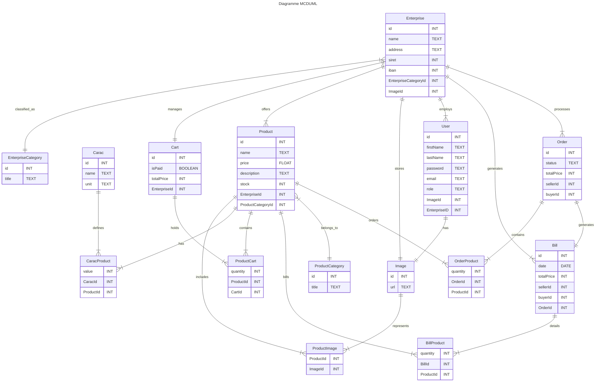

```mermaid
---
title: Diagramme MCDUML
---
erDiagram
    Product {
        id INT
        name TEXT
        price FLOAT
        description TEXT
        stock INT
        EnterpriseId INT
        ProductCategoryId INT
    }

    ProductCart {
        quantity INT
        ProductId INT
        CartId INT
    }

    Carac {
        id INT
        name TEXT
        unit TEXT
    }

    CaracProduct {
        value INT
        CaracId INT
        ProductId INT
    }

    Cart {
        id INT
        isPaid BOOLEAN
        totalPrice INT
        EnterpriseId INT
    }

    User {
        id INT
        firstName TEXT
        lastName TEXT
        password TEXT
        email TEXT
        role TEXT
        ImageId INT
        EnterpriseID INT
    }

    Image {
        id INT
        url TEXT
    }

    ProductImage {
        ProductId INT
        ImageId INT
    }

    ProductCategory {
        id INT
        title TEXT
    }

    EnterpriseCategory {
        id INT
        title TEXT
    }

    Enterprise {
        id INT
        name TEXT
        address TEXT
        siret INT
        iban INT
        EnterpriseCategoryId INT
        ImageId INT
    }

    Bill {
        id INT
        date DATE
        totalPrice INT
        sellerId INT
        buyerId INT
        OrderId INT
    }

    Order {
        id INT
        status TEXT
        totalPrice INT
        sellerId INT
        buyerId INT
    }

    BillProduct {
        quantity INT
        BillId INT
        ProductId INT
    }

    OrderProduct {
        quantity INT
        OrderId INT
        ProductId INT
    }

    Product ||--|{ ProductImage : "includes"
    Image ||--|{ ProductImage : "represents"

    Product ||--|{ CaracProduct : "has"
    Carac ||--|{ CaracProduct : "defines"

    Product ||--|{ ProductCart : "contains"
    Cart ||--|{ ProductCart : "holds"

    Product ||--|{ BillProduct : "bills"
    Bill ||--|{ BillProduct : "details"

    Product }|--|| ProductCategory : "belongs_to"
    Product ||--|{ OrderProduct : "orders"
    Order ||--|{ OrderProduct : "contains"

    User ||--|| Image : "has"

    Order ||--|| Bill : "generates"
    Enterprise }|--|| EnterpriseCategory : "classified_as"

    Enterprise ||--|| Cart : "manages"

    Enterprise ||--|{ Product : "offers"

    Enterprise ||--|| Image : "stores"

    Enterprise ||--|{ User : "employs"

    Enterprise ||--|{ Bill : "generates"

    Enterprise ||--|{ Order : "processes"
```