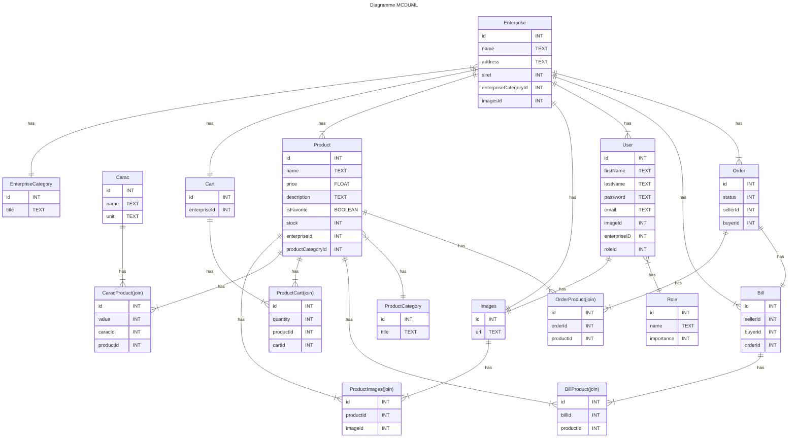

```mermaid
---
title : Diagramme MCDUML
---
erDiagram
    Product{
        id INT
        name TEXT
        price FLOAT
        description TEXT
        isFavorite BOOLEAN
        stock INT
        enterpriseId INT
        productCategoryId INT
    }
        ProductCart["ProductCart(join)"]{
        id INT
        quantity INT
        productId INT
        cartId INT
    }
    Carac{
        id INT
        name TEXT
        unit TEXT
    }
    CaracProduct["CaracProduct(join)"]{
        id INT
        value INT
        caracId INT
        productId INT
    }
    Cart{
        id INT
        enterpriseId INT
    }
    User{
        id INT
        firstName TEXT
        lastName TEXT
        password TEXT
        email TEXT
        imageId INT
        enterpriseID INT
        roleId INT
    }
    Images{
        id INT
        url TEXT
    }
    ProductImages["ProductImages(join)"]{
        id INT
        productId INT
        imageId INT
}
    Role{
        id INT
        name TEXT
        importance INT
    }
    ProductCategory{
        id INT
        title TEXT
    }
    EnterpriseCategory{
        id INT
        title TEXT
    }
    Enterprise{
        id INT
        name TEXT
        address TEXT
        siret INT
        enterpriseCategoryId INT
        imagesId INT
    }
    Bill{
        id INT
        sellerId INT
        buyerId INT
        orderId INT
    }
    Order{
        id INT
        status INT
        sellerId INT
        buyerId INT
    }
    BillProduct["BillProduct(join)"]{
        id INT
        billId INT
        productId INT
    }
    OrderProduct["OrderProduct(join)"]{
        id INT
        orderId INT
        productId INT
    }
  

    
    Product ||--|{ ProductImages : has
    Images ||--|{ ProductImages : has
    
    Product ||--|{ CaracProduct : has
    Carac ||--|{ CaracProduct : has
    
    Product ||--|{ ProductCart : has
    Cart ||--|{ ProductCart : has

    Product ||--|{ BillProduct : has
    Bill ||--|{ BillProduct : has

    Product }|--|| ProductCategory : has
    Product ||--|{ OrderProduct : has
    Order ||--|{ OrderProduct : has


    User ||--|| Images : has

    User }|--|| Role : has

    Order ||--|| Bill : has
    Enterprise }|--|| EnterpriseCategory : has

    Enterprise ||--|| Cart : has

    Enterprise ||--|{ Product : has

    Enterprise ||--|| Images : has

    Enterprise ||--|{ User : has

    Enterprise ||--|{ Bill : has

    Enterprise ||--|{ Order : has
```
